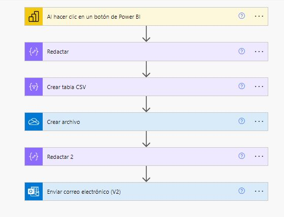

# Notificación de Reporte CSV vía Correo Electrónico

Este flujo de **Power Automate** automatiza la creación y el envío de un archivo CSV generado a partir de una acción en **Power BI**. El flujo está diseñado para ser activado manualmente desde Power BI, generar un reporte en formato CSV, crear un archivo con esa información, y enviar una notificación por correo electrónico con el archivo adjunto.

## 📄 Descripción del Flujo

El flujo consta de las siguientes acciones:

1. **Al hacer clic en un botón de Power BI**: 
   - Este es el evento disparador del flujo. El flujo se ejecuta cuando el usuario hace clic en un botón integrado en un reporte de Power BI.

2. **Redactar**: 
   - Una acción intermedia para procesar o preparar los datos que serán incluidos en el reporte.

3. **Crear tabla CSV**:
   - Se genera una tabla con los datos procesados en formato CSV. Esta tabla es la que se utilizará para crear el archivo CSV.

4. **Crear archivo**:
   - Se crea un archivo en un almacenamiento específico (como OneDrive o SharePoint) con el contenido de la tabla CSV generada en el paso anterior.

5. **Redactar 2**:
   - Esta acción sirve para preparar el cuerpo del correo o manipular más datos según sea necesario.

6. **Enviar correo electrónico (V2)**:
   - Finalmente, se envía un correo electrónico con el archivo CSV adjunto al destinatario. Este correo puede incluir un mensaje personalizado en el cuerpo del mismo.

## 🚀 Cómo Utilizar el Flujo

1. **Configuración en Power BI**: 
   - Integra este flujo con Power BI, añadiendo un botón en tu informe que sirva como disparador. Cada vez que se haga clic, el flujo se activará.
   
2. **Generación de CSV**:
   - Al hacer clic en el botón, se generará un archivo CSV con los datos relevantes del informe o análisis en cuestión.
   
3. **Notificación vía Correo**:
   - Recibirás un correo electrónico con el archivo CSV adjunto, el cual contiene los datos del reporte generado.

## 🔧 Requisitos

- **Power BI**: El flujo se activa desde un informe de Power BI mediante un botón interactivo.
- **Cuenta de almacenamiento**: Puede ser **OneDrive**, **SharePoint**, o cualquier otro servicio donde se pueda guardar el archivo CSV generado.
- **Cuenta de Correo**: Necesitas una cuenta configurada para el envío de correos electrónicos (ej: Outlook).
- **Credenciales**: Asegúrate de que tienes configuradas las conexiones necesarias para acceder a Power BI, el almacenamiento donde se guardará el archivo, y el servicio de correo.

## 📊 Diagrama del Flujo

El flujo incluye varias acciones organizadas en secciones que cubren las diferentes fases del proceso. En la siguiente imagen se muestra el diagrama completo del flujo de Power Automate:

