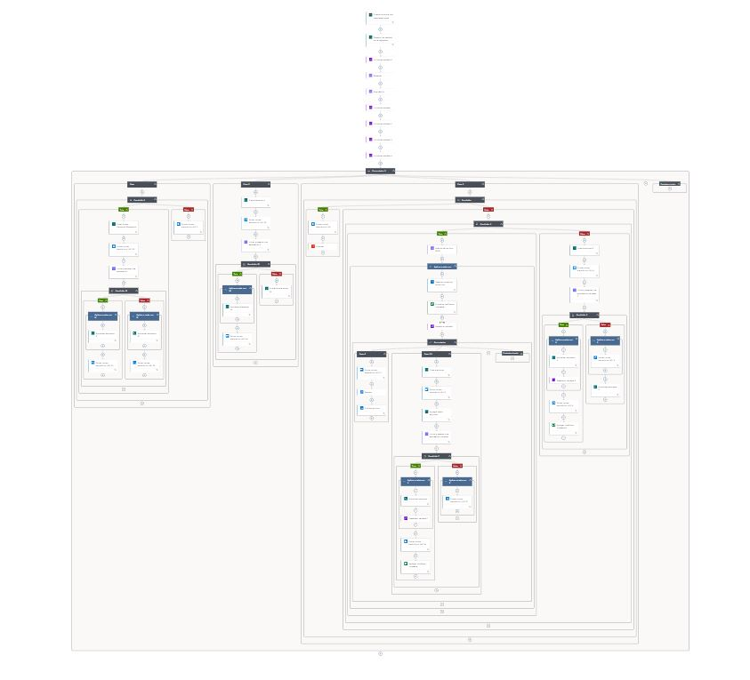

# Power Automate Flow - RPA Help Desk

Este repositorio contiene un flujo de **Power Automate** diseñado para automatizar procesos relacionados con la gestión de tickets en un sistema de **Help Desk**. El flujo ha sido creado con el objetivo de optimizar la comunicación entre el equipo de soporte y los clientes, manejando la creación, actualización y cierre de tickets de manera eficiente.

## 📄 Descripción del Flujo

El flujo está diseñado para ejecutar múltiples procesos secuenciales y paralelos en respuesta a eventos y condiciones específicas. Aquí están algunos de los componentes y acciones claves que realiza el flujo:

- **Triggers y Eventos**: 
  - El flujo se activa cuando ocurre un evento en una base de datos o plataforma, como la creación de un nuevo ticket de soporte o una actualización de estado.
  
- **Procesos Principales**:
  - **Verificación de Datos**: Validación de la información del ticket para asegurar que todos los campos requeridos estén completos.
  - **Asignación Automática**: Asignación de tickets al equipo de soporte correspondiente basado en la prioridad y categoría del problema.
  - **Notificaciones**: Envío de correos electrónicos a los usuarios cuando el ticket ha sido asignado, actualizado o cerrado.
  - **Cierre Automático**: Cierre automático de tickets inactivos después de un período determinado de inactividad.

- **Condiciones y Ramas**: 
  - Uso de condiciones para manejar la bifurcación del flujo dependiendo del estado del ticket o la respuesta del cliente.
  
- **Acciones Integradas**:
  - **Consultas a bases de datos** para obtener información sobre el ticket o el usuario.
  - **Actualización de registros** en el sistema de gestión de tickets.
  - **Notificaciones vía correo electrónico** automatizadas para mantener informados tanto a los usuarios finales como a los agentes de soporte.

## 📊 Diagrama del Flujo

El flujo incluye varias acciones organizadas en secciones que cubren las diferentes fases del proceso. En la siguiente imagen se muestra el diagrama completo del flujo de Power Automate:



## 🚀 Cómo Utilizar el Flujo

1. **Importar el Flujo**: Puedes importar este flujo en tu instancia de **Power Automate** mediante el archivo `.zip` proporcionado.
2. **Configurar Conexiones**: Asegúrate de configurar correctamente las conexiones a tus servicios, como el sistema de tickets, correo electrónico, y base de datos.
3. **Personalizar el Flujo**: Ajusta las variables, condiciones y acciones según las necesidades de tu equipo y organización.

## 🔧 Requisitos

- **Power Automate** con acceso a las conexiones necesarias (Outlook, SQL Server, etc.).
- **Credenciales** para acceder al sistema de gestión de tickets y correo electrónico.
- Conexiones configuradas en Power Automate.

## 📦 Instalación

1. Clona este repositorio:
   ```bash
   git clone https://github.com/TuUsuario/SqlWorkout.git
